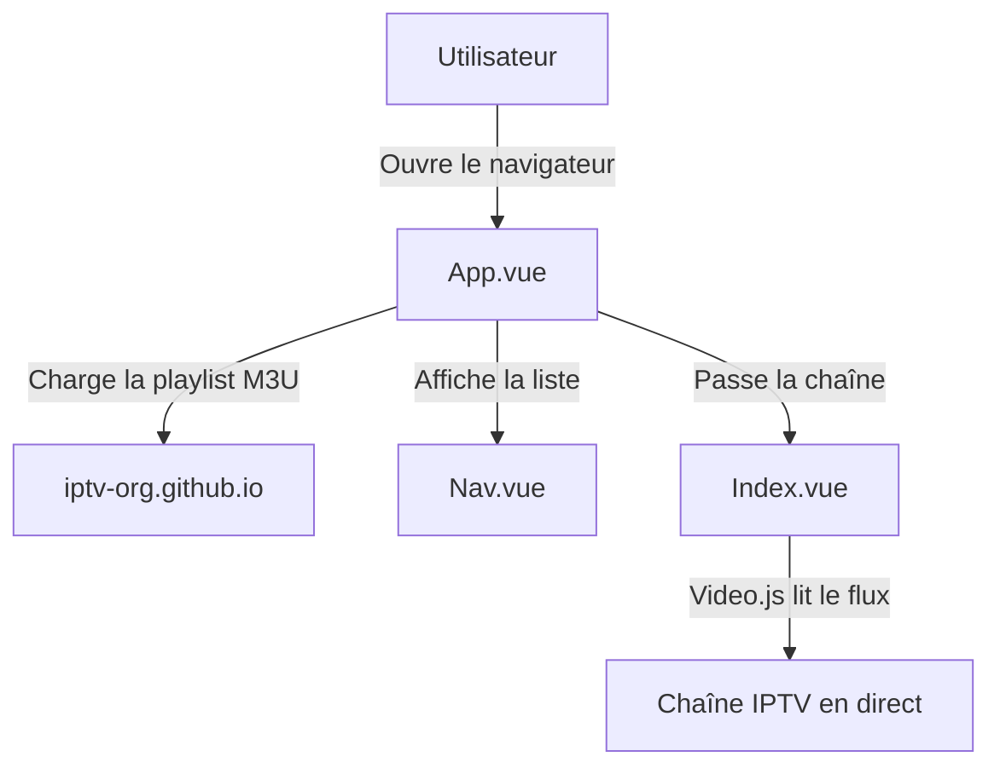
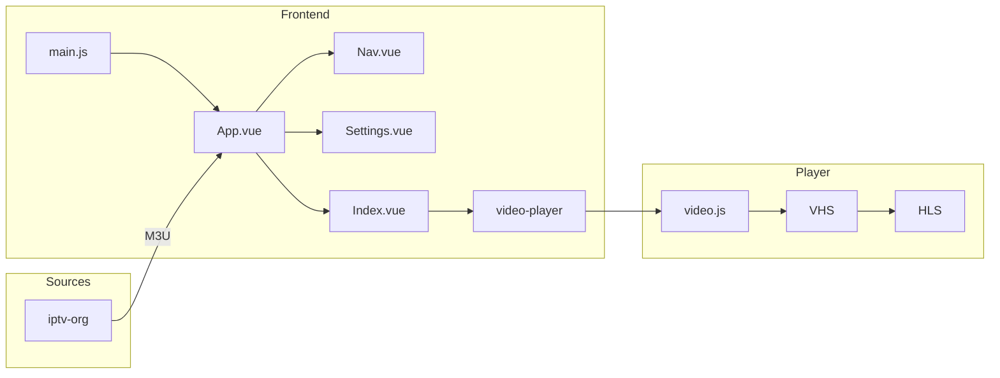
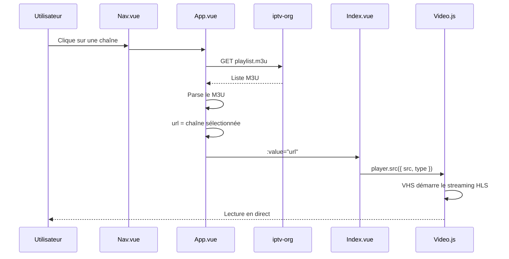
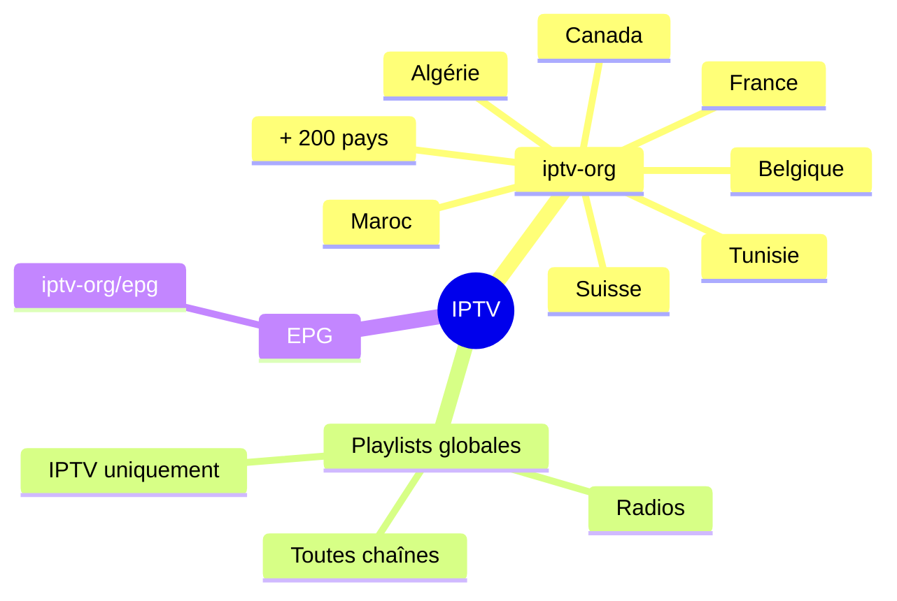
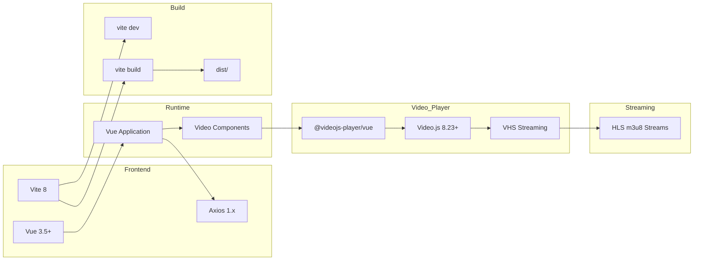
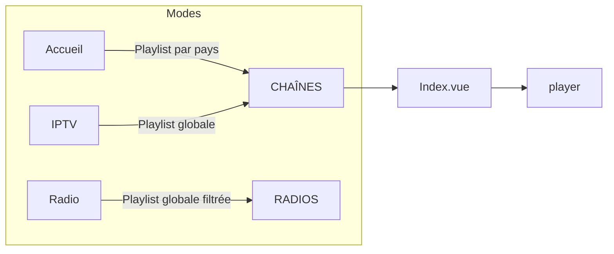

# Web TV Player

Lecteur IPTV web — Vue 3 + Video.js



## Démarrage rapide

```bash
npm install
npm run dev       # → http://localhost:4173
npm run build     # Build production dans dist/
```

## Live demo

👉 `http://135.225.88.163:4173/`

Compte demo : `admin@webtv.app` / `admin123`

## Fonctionnalités

- 🔐 Authentification email + pseudo (Supabase Auth)
- 📺 Lecture M3U/M3U8/HLS via Video.js
- 🌍 Playlists par pays (iptv-org)
- 🔍 Recherche de chaînes
- 🌙 Thème dark sobre
- 🔄 Gestion d'erreur réseau + retry auto
- 🌐 FR/EN

## Architecture



### Flux de chargement d'une chaîne



### Structure des fichiers

```
src/
├── main.js                 # Point d'entrée, plugins Vue
├── App.vue                 # Orchestrateur : playlist, routing, état
├── style.css               # Thème (variables CSS néon)
├── api/
│   └── index.js            # Fetch playlist (Axios GET)
├── assets/
│   └── logo.svg            # Logo de l'application
├── components/
│   ├── Nav.vue             # Menu latéral avec liste des chaînes
│   └── Settings.vue        # Modal de paramètres (pays, langue)
├── i18n/
│   ├── index.js            # Système de traduction en/fr
│   └── messages.js         # Clés de traduction
├── services/
│   └── authService.js      # Supabase Auth (login, register, logout)
├── utils/
│   ├── geolocation.js      # Sélection de pays + URLs iptv-org
│   └── tvlistsupport.js    # Parseur M3U/TXT/JSON
└── views/
    ├── Index.vue           # Lecteur vidéo (video-player)
    ├── Login.vue           # Connexion
    ├── Register.vue        # Inscription
    └── NotFound.vue        # Page 404
```

## Sources IPTV



### Playlists par pays

| Pays | Code | URL |
|------|------|-----|
| France | `fr` | `https://iptv-org.github.io/iptv/countries/fr.m3u` |
| Belgique | `be` | `https://iptv-org.github.io/iptv/countries/be.m3u` |
| Suisse | `ch` | `https://iptv-org.github.io/iptv/countries/ch.m3u` |
| Canada | `ca` | `https://iptv-org.github.io/iptv/countries/ca.m3u` |
| Algérie | `dz` | `https://iptv-org.github.io/iptv/countries/dz.m3u` |
| Maroc | `ma` | `https://iptv-org.github.io/iptv/countries/ma.m3u` |
| Tunisie | `tn` | `https://iptv-org.github.io/iptv/countries/tn.m3u` |
| États-Unis | `us` | `https://iptv-org.github.io/iptv/countries/us.m3u` |
| Royaume-Uni | `gb` | `https://iptv-org.github.io/iptv/countries/gb.m3u` |
| Allemagne | `de` | `https://iptv-org.github.io/iptv/countries/de.m3u` |
| Espagne | `es` | `https://iptv-org.github.io/iptv/countries/es.m3u` |
| Italie | `it` | `https://iptv-org.github.io/iptv/countries/it.m3u` |
| Portugal | `pt` | `https://iptv-org.github.io/iptv/countries/pt.m3u` |
| Pays-Bas | `nl` | `https://iptv-org.github.io/iptv/countries/nl.m3u` |
| Sénégal | `sn` | `https://iptv-org.github.io/iptv/countries/sn.m3u` |
| Côte d'Ivoire | `ci` | `https://iptv-org.github.io/iptv/countries/ci.m3u` |

### Playlists globales

| Type | URL |
|------|-----|
| Toutes les chaînes | `https://iptv-org.github.io/iptv/index.m3u` |
| IPTV uniquement | `https://iptv-org.github.io/iptv/categories/iptv.m3u` |
| Radio | `https://iptv-org.github.io/iptv/categories/radio.m3u` |

### Autres ressources

- [iptv-org/iptv](https://github.com/iptv-org/iptv) — La plus grande collection de chaînes gratuites (10 000+)
- [iptv-org/awesome-iptv](https://github.com/iptv-org/awesome-iptv) — Ressources et outils IPTV
- [iptv-org/epg](https://github.com/iptv-org/epg) — Guide des programmes
- [Free-TV/IPTV](https://github.com/Free-TV/IPTV) — Playlists alternatives
- [ParveenBhadooOfficial/List-of-free-IPTV](https://github.com/ParveenBhadooOfficial/List-of-free-IPTV) — Liste de chaînes gratuites
- [iptv-restream/iptv](https://github.com/iptv-restream/iptv) — Playlists IPTV
- [nickkuk/iptv-m3u-filter](https://github.com/nickkuk/iptv-m3u-filter) — Filtrer les chaînes par catégorie
- [pierre-emmanuelJ/iptv-checker](https://github.com/pierre-emmanuelJ/iptv-checker) — Vérifier les flux M3U

## Stack technique



| Technologie | Version | Rôle |
|-------------|---------|------|
| Vue 3 | 3.2+ | Framework UI (Composition API) |
| Vite | 4.5+ | Serveur de dev + build |
| Video.js | 8.3+ | Lecteur vidéo HTML5 |
| @videojs-player/vue | 1.0+ | Wrapper Vue pour Video.js |
| Axios | 1.4+ | HTTP client pour les playlists |
| Supabase | 2.106+ | Auth + base de données |
| SendGrid | — | Emails transactionnels (confirmation, notifications) |

## Formats supportés

| Format | Extension | Statut |
|--------|-----------|--------|
| M3U | `.m3u` | ✅ |
| M3U8 | `.m3u8` | ✅ (alias m3u) |
| TXT (CSV) | `.txt` | ✅ |
| JSON | `.json` | ✅ |
| HLS | flux m3u8 | ✅ (via VHS) |

## Modes



- **Accueil** — Playlist basée sur le pays sélectionné
- **IPTV** — Playlist globale (toutes les chaînes)
- **Radio** — Playlist globale filtrée (stations radio uniquement)

## Email & notifications

Les emails transactionnels sont gérés par **Supabase Auth + SendGrid** (SMTP) :

- **Confirmation d'inscription** — envoyé automatiquement par Supabase Auth
- **Emails personnalisés** — via la Edge Function `send-email`

```javascript
import { supabase } from './services/supabase.js'

await supabase.functions.invoke('send-email', {
  body: { to: "user@exemple.com", subject: "Sujet", html: "<h1>Message</h1>" }
})
```

La Edge Function est déployée sur Supabase et utilise l'API SendGrid avec une clé API stockée dans les secrets du projet.

## Internationalisation

Français et anglais supportés. Détection automatique basée sur la langue du navigateur.

## Licence

MIT